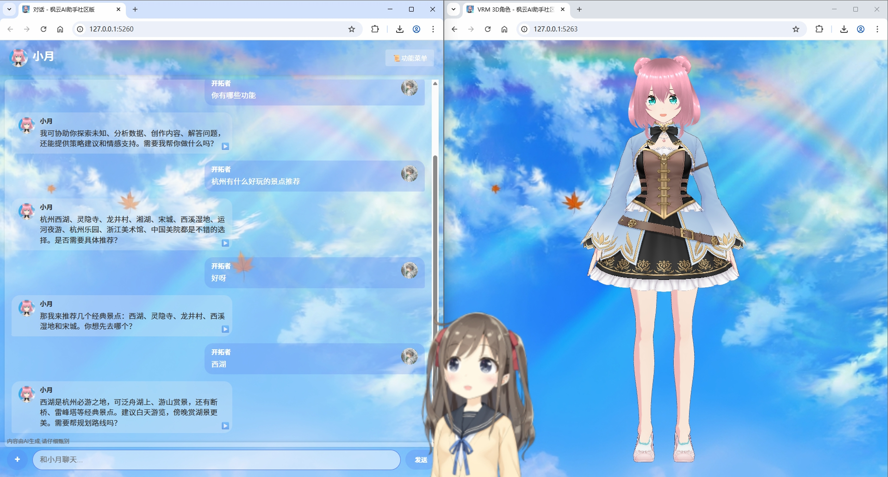
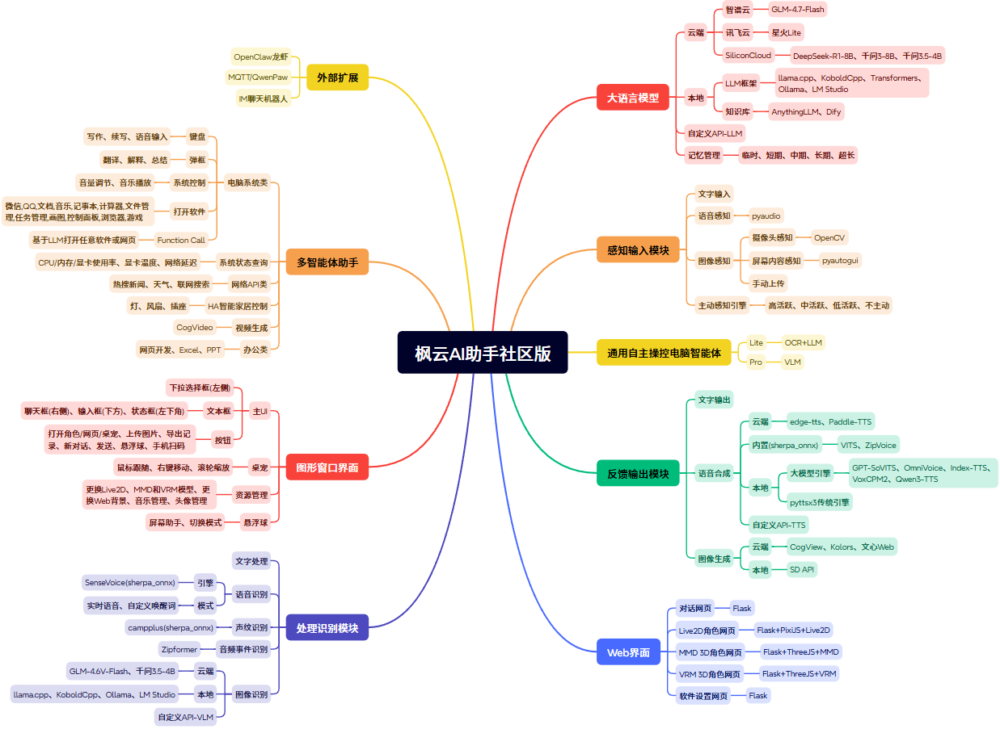

# 枫云AI助手社区版 v4.2

  

**枫云AI助手社区版 v4.2** 是由 **MewCo-AI** 开源的高自由度二次元AI助手框架。支持声纹识别语音交互、文本对话、语音合成、图像识别、桌宠模式、Live2D/MMD/VRM 3D角色展示、多智能体助手、自主操控电脑、龙虾接口等丰富功能。用户可通过Web界面、桌宠或悬浮球与助手进行互动，助手能够根据用户输入进行智能回复，并支持多种语言模型和语音合成引擎。


## 功能特性

### 🤖 核心交互能力
- **高自由度与模块化扩展性**：面向开发者的开源框架，支持修改代码二次开发以实现高度个性化的AI助手。
- **广泛的开源AI生态**：对接多种云端/本地大语言模型、多模态模型、语音合成大模型。支持GLM、Qwen、DeepSeek、Qwen-VL多模态模型等，并兼容OpenAI标准API。
- **声纹识别语音交互**：通过SenseVoice本地ASR引擎实现实时语音识别，支持流畅的语音交流。语音合成功能支持打断，用户可通过语音、按钮或按键方式中断过长的回复。还支持声纹识别功能，助手只应答特定用户的声音。
- **音频事件检测**：自动识别环境中的声音事件（如咳嗽、敲门、猫叫、手机铃声等），增强交互场景感知能力。
- **多模态图像识别**：支持电脑屏幕画面/摄像头内容/手动上传图片的多模态图像识别。
- **本地知识库**：对接本地AnythingLLM、Dify聊天助手，提升助手的理解与回应精度。




### 🖥️ 多设备全平台访问
- 在Windows电脑上运行后，局域网内的设备（电脑、手机、平板、电视、车机等）可通过浏览器访问助手。
- **手机扫码便捷访问**：点击主界面“手机网页访问”按钮，生成二维码，手机扫码即可快速进入对话界面。
- **Web端优化**：新增语音播放按钮，手机端按钮排版优化，支持移动端触摸交互。

### 🎮 多形态展示与交互
- **桌宠模式**：支持Live2D桌面宠物模式，助手可置顶，支持拖拽、缩放和右键菜单操作。
- **悬浮球模式**：可切换至悬浮球模式，悬浮于桌面任意位置，右键菜单支持翻译屏幕、解释屏幕、总结屏幕、切换语音模式等功能。
- **Live2D角色互动**：鼠标/手指实时跟随，视线追踪。
- **MMD 3D角色展示**：嘴部随语音输出同步动画。
- **VRM 3D角色展示**：支持触摸互动、点头、挥手等肢体反馈。

### 🧠 多智能体助手模式
支持调用多种智能体，实现丰富功能：

| 类别 | 功能                                         |
|------|--------------------------------------------|
| 媒体娱乐 | 音乐播放、视频生成                                  |
| 办公创作 | 文本写作、PPT制作、表格制作、网页开发                       |
| 屏幕智能 | 翻译屏幕、解释屏幕、总结屏幕、续写屏幕内容                      |
| 设备控制 | 打开软件/网页、音量调节、灯/风/插座类智能家居控制（Home Assistant） |
| 信息查询 | 天气查询、热搜新闻、系统状态查询、联网搜索                      |
| 语音输入 | 语音转文字输入                                    |

### 🎯 自主操控电脑（Lite & Pro）
- **自主操控Lite**：基于OCR文字识别和LLM生成操作步骤，自动执行电脑操作（如打开软件、点击按钮、输入文本等）。
- **自主操控Pro**：基于VLM多模态视觉模型，单步迭代控制鼠标键盘，支持完成复杂任务（如视频点赞、文件管理等），支持ESC键随时中断。

### 🔌 扩展对接能力
- **IM聊天机器人**：支持对接钉钉、飞书、QQ机器人，实现跨平台智能问答。
- **OpenClaw龙虾**：对接OpenClaw超级智能体网关，扩展AI能力边界。
- **MQTT/QwenPaw**：通过MQTT协议对接QwenPaw助理，支持物联网场景集成。
- **Home Assistant**：支持灯/风扇/插座类智能家居设备的按钮控制。

### 🔊 语音合成引擎（新增）
- **Qwen3-TTS**：零样本语音合成大模型。
- **ZipVoice**：内置零样本语音克隆TTS引擎。
- **OmniVoice & VoxCPM2**：支持声音克隆与声音设计两种模式。

### 🎨 丰富的自定义设置
- **助手设置**：名称、提示词、唤醒词、记忆模式。
- **角色模型**：Live2D/MMD/VRM 3D模型路径、位置、大小、骨骼索引配置。
- **AI引擎**：ASR/LLM/TTS/VLM/绘画引擎自由切换，支持本地/云端/自定义API。
- **系统设置**：网页化配置界面。

### 📷 主动感知对话
支持根据时间、屏幕内容、摄像头内容等主动发起对话，提供更自然的交互体验。

### 💬 提示词对话
基于所选的大语言模型、AI助手提示词、语音合成引擎和图像识别引擎，与用户进行自然语言交流。

## 安装与使用

### 环境要求

| 项目 | 最低配置 | 推荐配置 |
|------|----------|----------|
| 操作系统 | Windows 10 | Windows 11 |
| 处理器 | Intel Core i5 8th / AMD R5 3000 | Intel Core i7 9th / AMD R7 5700 |
| 内存 | 8GB RAM | 16GB RAM |
| 显卡 | Intel UHD 620 核显 | NVIDIA RTX 3060 |
| 存储空间 | 3GB可用空间 | 5GB可用空间 |
| 网络 | 联网使用（可选离线） | 联网使用（可选离线） |
| 麦克风 | 0.5米拾音（语音输入需求） | 3米拾音阵列麦克风 |
| 摄像头 | 720P彩色（多模态需求） | 1080P彩色 |

### 安装步骤

#### 方法一（推荐）：下载安装整合包

1. **下载整合包**：从官方网站下载：[下载链接](https://mewco-ai.github.io/2024/07/09/asstcomm/)

2. **解压并运行**：使用7-Zip或Bandizip解压，双击运行"枫云AI助手社区版.bat"启动软件。

3. **本地AI引擎（可选）**：下载枫云AI助手插件-本地端侧AI引擎扩展包：[下载链接](https://mewco-ai.github.io/2024/03/13/engine/)

#### 方法二：源码安装（面向开发者）

1. **克隆仓库**
   ```bash
   git clone https://github.com/MewCo-AI/mewco_ai_assistant_comm.git 
   cd mewco_ai_assistant_comm
   ```

2. **安装依赖**
   ```bash
   conda create -n maiac python==3.12
   conda activate maiac
   pip install -r requirements.txt
   ```

3. **配置环境**
   - 在 `data/db/config.json` 中填写云端API密钥（GLM智谱、SiliconCloud、讯飞星火等）。
   - 从 [网盘模型整合包](https://pan.baidu.com/s/1-drDeS7W-2HSLKx-hBLycg?pwd=maia) 下载ASR、声纹识别、音频事件检测、TTS模型，解压至 `data/model` 文件夹。

4. **运行应用**
   ```bash
   python main.py
   ```
   启动后访问 `http://127.0.0.1:5260` 进入Web界面。

### 使用说明

- **首次启动配置**：双击bat文件打开软件 → 点击右上角“软件设置” → 配置云端API Key → 保存并重启 → 完成初始化。

- **语音交互**：默认关闭实时语音，按 `Alt+x` 切换开关。打开后可在任意界面与助手对话。

- **文本交互**：在主界面输入框输入文本，或通过Web界面打字聊天。

- **多智能体助手**：在运行模式切换中选择“多智能体助手”，即可使用全部智能体功能。

- **自主操控电脑**：选择“自主操控Lite”或“自主操控Pro”，输入指令即可自动化操作电脑。

- **悬浮球模式**：点击主界面“切换至悬浮球”，助手以圆形图标悬浮于桌面，右键菜单支持快捷功能。

- **手机访问**：点击“手机网页访问”生成二维码，手机扫码即可在同一WiFi下访问助手。

- **角色展示**：
  - L2D角色：鼠标/手指实时跟随
  - MMD角色：嘴部语音同步
  - VRM角色：触摸互动反馈
  - L2D桌宠：可拖拽、缩放

## 项目结构

```
mewco_ai_assistant_comm/
├── data/                    # 数据文件
│   ├── cache/               # 缓存文件（截图、音频、临时文件）
│   ├── db/                  # 配置文件（config.json、记忆库、偏好等）
│   ├── docs/                # README文档图片资源
│   ├── image/               # 图片资源（logo、头像、UI图标）
│   ├── model/               # AI模型资源
│   │   ├── ASR/             # 语音识别模型（SenseVoice）
│   │   ├── TTS/             # 语音合成模型（VITS、ZipVoice）
│   │   └── SpeakerID/       # 声纹识别模型
│   ├── music/               # 本地音乐目录
│   └── music_vmd/           # MMD动作音乐目录
├── dist/                    # 前端静态资源
│   ├── web_settings.html    # 设置网页代码
│   └── assets/              # Live2D/MMD/VRM模型、JS/CSS资源
├── agent.py                 # 智能体功能模块
├── agi_pc_lite.py           # 自主操控Lite模块
├── agi_pc_pro.py            # 自主操控Pro模块
├── ase.py                   # 主动感知模块
├── asr.py                   # 语音识别模块
├── chat_web.py              # Web聊天界面与宠物API
├── function.py              # 通用功能函数
├── gui_qt.py                # Qt桌面宠物
├── gui_set.py               # 设置界面
├── gui_sub.py               # GUI子组件
├── im_bot.py                # IM机器人（钉钉/飞书/QQ）
├── live2d.py                # Live2D角色服务
├── llm.py                   # 大语言模型模块
├── main.py                  # 主程序入口
├── main_sub.py              # 主程序子模块（OpenClaw/MQTT）
├── mmd.py                   # MMD 3D角色服务
├── sys_init.py              # 系统初始化与配置加载
├── tts.py                   # 语音合成模块
├── vlm.py                   # 图像识别模块
├── vrm.py                   # VRM 3D角色服务
├── websearch.py             # 联网搜索模块
└── requirements.txt         # Python依赖列表
```

## 配置说明

### 支持的AI引擎

#### 大语言模型（LLM）
- 云端：GLM-4.7-Flash、千问Qwen3-8B/Qwen3.5-4B、DeepSeek-R1-8B、星火Lite
- 本地：llama.cpp、KoboldCpp、Ollama、LM Studio、Transformers
- 知识库：Dify、AnythingLLM
- 自定义API-LLM：兼容OpenAI API标准(如vLLM等)

#### 语音合成（TTS）
- 云端：edge-tts、Paddle-TTS
- 本地：GPT-SoVITS、OmniVoice、VoxCPM、Qwen-TTS、Index-TTS
- 内置：低延迟VITS、ZipVoice、系统TTS
- 自定义API-TTS：兼容OpenAI API标准

#### 图像识别（VLM）
- 云端：GLM-4.6V-Flash、千问Qwen3.5-4B
- 本地：llama.cpp、KoboldCpp、Ollama VLM、LM Studio
- 自定义API-VLM：兼容OpenAI API标准(如vLLM等)

#### 图像生成（绘画）
- 云端：CogView-3-Flash、Kolors、文心Web
- 本地：Stable Diffusion API

## 常见问题解答

### Q1: 软件启动闪退怎么办？
- **整合包用户**：前往 `C:\Users\用户名\AppData\Roaming\Python`，将Python312文件夹重命名为`Python312_backup`，重新启动软件。
- **源码用户**：检查Python版本是否为3.12，确认依赖已完整安装。

### Q2: 点击打开桌宠/角色不显示？
- 可能是Windows渲染库问题，尝试更新显卡驱动或在另一台电脑上测试。
- 检查模型路径是否正确，尝试恢复默认设置。

### Q3: 服务不可用/API调用失败？
- 检查API Key是否正确配置，网络是否通畅。
- 尝试切换其他对话模型或语音合成引擎。
- 下载本地AI引擎扩展包实现离线使用。

### Q4: 语音识别不完整/没反应？
- 调整语音识别灵敏度（高/中/低）。
- 调节电脑麦克风音量。
- 检查麦克风编号配置是否正确。

### Q5: 助手语音自我打断/自言自语？
- 推荐选择“自定义唤醒词”模式。
- 佩戴耳机使用，或调低扬声器音量。
- 录制个人声纹，助手只应答主人语音。

### Q6: MMD/VRM 3D角色网页卡顿？
- Chrome浏览器：设置 → 系统 → 开启“使用图形加速功能”。
- 确保显卡驱动已更新。

### Q7: 被杀毒软件误报？
- 本软件为绿色开源软件，请放心使用。
- 从杀毒软件隔离区恢复并添加至信任区。

## 更新日志（v4.2）

### 新增功能
- 对接Qwen3-TTS、ZipVoice语音合成引擎
- 对接KoboldCpp、原生llama.cpp本地GGUF框架
- 对接钉钉、飞书、QQ机器人（IM聊天机器人）
- 新增手机扫描二维码便捷访问助手
- 新增音频事件检测（咳嗽、敲门、猫叫、手机铃声等）
- 新增悬浮球模式（翻译屏幕、解释屏幕、总结屏幕等快捷功能）
- 新增自主操控Lite（OCR+LLM自动操作电脑）
- 新增自主操控Pro（VLM多模态单步迭代控制）
- 智能体新增网页开发、PPT制作、表格制作
- Web端新增音频播放按钮，手机端按钮排版优化
- 重构系统设置（网页化配置界面）
- Home Assistant支持风扇/插座类设备控制
- 对接OmniVoice、VoxCPM2语音引擎（支持声音克隆/声音设计）
- 对接OpenClaw龙虾超级智能体
- 对接MQTT/QwenPaw助理

## 开源协议及注意事项

本项目采用 **GPL-3.0** 开源协议，详情请参阅 [LICENSE](LICENSE) 文件。

⚠️ **严禁商用、套壳和倒卖**，请遵守开源协议使用。MewCo-AI严格遵照国家相关标准为AI生成内容添加专属标识并作出相关提示，同时明确提醒用户禁止发布违规内容、篡改标识、传播不良信息、开展违规情感互动等行为，用户若违反规定需自行承担相应法律责任。

## 致谢

- 助手[小月]Live2D模型版权：Live2D inc.
- 感谢以下等开源项目：
  - [GPT-SoVITS](https://github.com/RVC-Boss/GPT-SoVITS)
  - [sherpa-onnx](https://github.com/k2-fsa/sherpa-onnx)
  - [OpenCV](https://github.com/opencv/opencv-python)
  - [FunAudioLLM](https://github.com/FunAudioLLM)
  - [edge-tts](https://github.com/rany2/edge-tts)
  - [QwenLM](https://github.com/QwenLM)
  - [llama.cpp](https://github.com/ggml-org/llama.cpp)
  - [Flask](https://github.com/pallets/flask)
  - [three.js](https://github.com/mrdoob/three.js)
  - [Live2D](https://www.live2d.com/)
  - [RapidOCR](https://github.com/RapidAI/RapidOCR)

## 联系开发者团队

- **Email**: [mewcoai@foxmail.com](mailto:mewcoai@foxmail.com) 
- **GitHub**: https://github.com/MewCo-AI
- **项目主页**: https://mewco-ai.github.io/2024/07/09/asstcomm/
- **GitHub仓库**: https://github.com/MewCo-AI/mewco_ai_assistant_comm

---

⭐ 如果觉得本项目对您有帮助，欢迎Star支持！